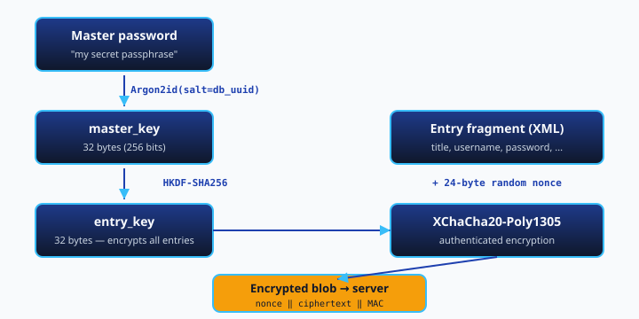
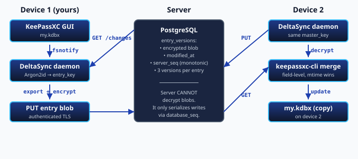
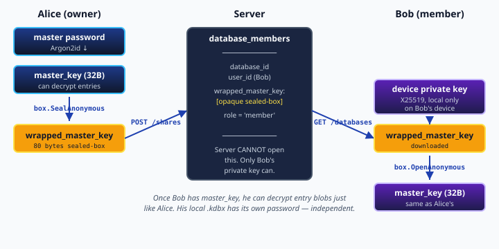

# KeePass Delta-Sync

Entry-level synchronization for KeePass databases (`.kdbx`) that reuses KeePassXC's own merge engine to handle concurrent edits from multiple devices without loss.

The file format (`.kdbx`) is unchanged. Sync happens through a small server that only ever sees client-encrypted blobs — your master password never leaves your device.

- **Documentation:** [project wiki](https://gitlab.com/Star95/keepass-deltasync/-/wikis/home) — getting started, running your own server, architecture, and troubleshooting. (Visual diagrams and a live introduction are on the [website](https://deltasync.bjoerck-braun.dk/).)
- **Pre-built client binaries:** [Releases](https://gitlab.com/Star95/keepass-deltasync/-/releases) — Linux, macOS, Windows; no Go toolchain required.
- **Deep dive:** [`docs/`](docs/) — threat model, concurrent-write semantics, deployment recipes. Full specification in [`keepass-deltasync-spec.md`](keepass-deltasync-spec.md).

## Repository layout

This monorepo contains four components, each with its own license:

| Directory | Component | License | Language |
|-----------|-----------|---------|----------|
| [`server/`](server/) | Sync server | AGPL-3.0-or-later | PHP 8.2 + PostgreSQL |
| [`client/`](client/) | Desktop sync agent | GPL-3.0-or-later | Go |
| [`android/`](android/) | Android client | GPL-3.0-or-later | Go (gomobile) + Kotlin |
| [`docs/`](docs/) | Shared documentation | CC-BY-SA-4.0 | Markdown |

Client and server only communicate over a well-defined HTTP API, so GPL/AGPL does not bleed across the boundary.

## Status

**v1 and v2 multi-user sharing are feature-complete and in active use** (as of 2026-05-29).

- **Server** (PHP / PostgreSQL): live on shared hosting. Endpoints for enrollment, entries with 3-version history, restore, admin CLI, audit log.
- **Desktop client** (Go): `enroll`, `init`, `init-shared`, `push`, `pull`, `sync`, `daemon` (fsnotify + polling), `versions`, `restore`, `share` / `unshare` / `shares`. Crypto: Argon2id → HKDF → XChaCha20-Poly1305 for entries; X25519 sealed-box for sharing. v3 canonical wire-format with dual-read of v1 legacy blobs during migration.
- **Android client**: sync core feature-complete (40 tests green), enrollment UI works, `:app` builds as installable debug APK. Kdbx file picker + actual sync trigger UI still to come — see [`android/README.md`](android/README.md). Built on top of `client/mobile/` via `gomobile bind` + kotpass.

## How it works

### Crypto stack

The client derives an entry encryption key from your master password and encrypts each entry locally. The server only ever stores the opaque blob.



- **Argon2id** raises the cost of brute-forcing the master password (~200 ms, 64 MiB RAM per attempt).
- **HKDF-SHA256** gives a clean, deterministic separation between the master key and per-use-case subkeys.
- **XChaCha20-Poly1305** provides authenticated encryption — the server cannot tamper with blobs undetected.
- **24-byte random nonces** make nonce reuse practically impossible.

### Bidirectional sync

The daemon reacts to two triggers: *fsnotify* (you saved in KeePassXC) and *polling* (changes from other devices). Merges happen on the client via `keepassxc-cli`, field-level, last-writer-wins on `LastModificationTime`.



Both devices derive the same `master_key` from the same master password. The server only serializes writes via a monotonic `database_seq`; it cannot decrypt anything.

### Multi-user sharing

To share a database with another user, the owner wraps `master_key` with the recipient's device public key using NaCl's anonymous sealed-box. The server stores the opaque wrap but cannot open it.



Once Bob has `master_key`, he can decrypt entries just like Alice. His local `.kdbx` has its own password, independent of Alice's. See [`docs/v2-concurrent-write-semantics.md`](docs/v2-concurrent-write-semantics.md) for how concurrent edits are handled.

## Getting started

### As an administrator (server side)

**Run your own server with Docker (easiest).** A prebuilt, multi-arch image (amd64 + arm64) is published to the GitLab Container Registry, and [`compose.yml`](compose.yml) brings up a self-contained stack (PostgreSQL + app). It works on any Docker host or a NAS such as TrueNAS SCALE / Unraid / Synology — paste the YAML, set one password, start:

```sh
# edit the single CHANGE_THIS password line in compose.yml, then:
docker compose up -d
docker compose logs app                          # copy the one-time admin token
docker compose exec app php bin/admin user:create alice
```

Image: `registry.gitlab.com/star95/keepass-deltasync/server:latest`. Schema migrations run automatically on start. Full walkthrough — including TrueNAS, HTTPS and backups — in [`docs/self-hosting-docker.md`](docs/self-hosting-docker.md).

**Classic PHP hosting (no Docker).** The server is plain PHP with no build step; upload it and run the setup wizard. See [`server/README.md`](server/README.md) and [`docs/deployment.md`](docs/deployment.md). Schema lives in [`server/schema/`](server/schema/).

### As a first-time user (client side)

**Option A — download a pre-built binary** from [Releases](https://gitlab.com/Star95/keepass-deltasync/-/releases): pick your OS, extract, run. No Go toolchain.

**Option B — build from source** (requires Go 1.22+):

```sh
cd client && go build -o keepass-deltasync ./cmd/keepass-deltasync
```

Then (either option):

```sh
# Your administrator gave you an enrollment token
./keepass-deltasync enroll --server https://your-server.example.com <token>

# Register a local .kdbx
./keepass-deltasync init mypasswords ~/keepass/my.kdbx

# Sync once
./keepass-deltasync sync mypasswords

# Let the daemon sync automatically (fsnotify + polling)
./keepass-deltasync daemon --store-keyring
```

### As the recipient of a shared database (v2)

```sh
# Alice has shared her database with you. It shows up in your list:
./keepass-deltasync databases
# passwords  ...  role=member

# Bootstrap a local copy:
./keepass-deltasync init-shared passwords ~/keepass/shared.kdbx
# Prompt: pick a new local password for your copy
```

After that, sharing is transparent — `sync` / `daemon` behave the same as for owned databases.

### As the owner sharing a database (v2)

```sh
# Share with another user (they must be enrolled and have used the client at least once)
./keepass-deltasync share passwords bob

# List members
./keepass-deltasync shares passwords

# Remove a member (or leave a database you don't own)
./keepass-deltasync unshare passwords bob
```

## Trust model in brief

- **The server sees:** encrypted entry blobs, mtimes, deletions, user and device metadata, an audit log with IP and user-agent.
- **The server does not see:** entry content (titles, usernames, passwords), master passwords, or database master keys.
- **Multi-user sharing:** when Alice shares with Bob, the database `master_key` is sealed-box-encrypted to Bob's device public key. The server only sees the opaque sealed-box blob; only Bob's device private key can unwrap it.

See [`docs/threat-model.md`](docs/threat-model.md) for the full trust model.

## Contributing

- DCO sign-off required on commits (`git commit -s`).
- Security issues go through a private channel (security mail / GitLab security advisory), not public issues.
- At least two maintainers must approve changes to crypto or auth code.
